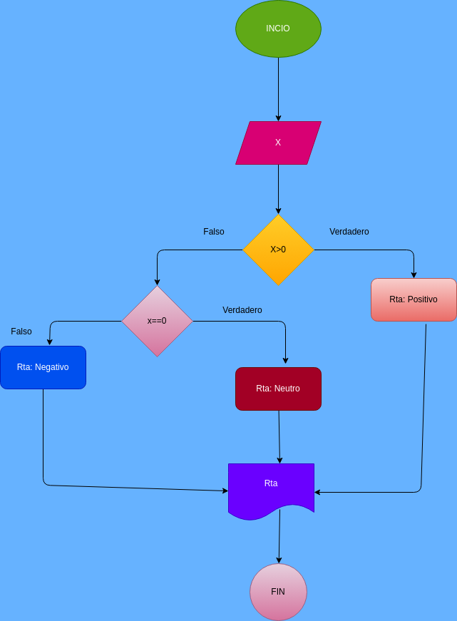

# Positivo_Negativo
Programa para verificar si un número es positivo, cero o negativo

# Crear un programa para verificar si un numero es par o impar

# ANALISIS

Variables de entrada

X : numero ingresado

Variables de salida

RTA : nos va a decir si es positivo o negativo

# DISEÑO

# CONSTRUCCION

ejecicio n.5 Implemetar un porgramar que verifique si un numero es positivo o negativo

usamso lo comparadores para determinar si es positivo o negativo
if x > 0
elif x == 0

## ESTE ARCHIVO ESTA ESCRITO NE LENGUAJE MARKDOWN